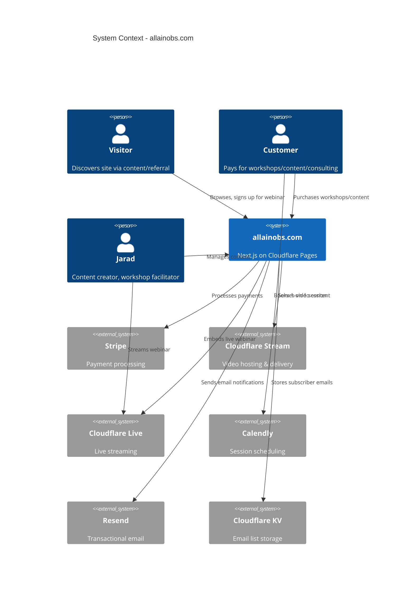
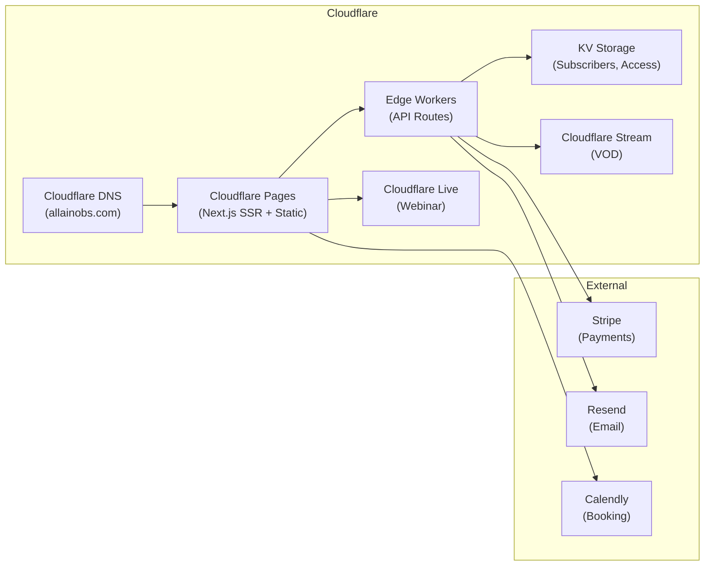

# Architecture Decision Document

## 1. System Context

allainobs.com is a marketing, commerce, and content delivery platform for an AI consulting business. It is a Next.js application deployed on Cloudflare Pages, integrating with Cloudflare Stream/Live for video, Stripe for payments, and external services for email and scheduling.

### System Context Diagram



---

## 2. Architecture Decisions

### AD-1: Hosting Platform

**Decision:** Cloudflare Pages with `@cloudflare/next-on-pages`

**Context:** Need static + server-side rendering, API routes for webhooks, and tight integration with Cloudflare Stream/Live/KV.

**Alternatives Considered:**
- Vercel: Best Next.js DX, but adds a separate billing/vendor layer when we're already deep in Cloudflare for video
- Self-hosted: Maximum control but unnecessary ops overhead for a marketing site

**Rationale:** Single vendor for hosting, video, DNS, KV storage, and CDN. Reduces billing complexity and latency between services. Next.js support via `@cloudflare/next-on-pages` is mature enough for this use case.

**Fallback:** If Cloudflare Pages Next.js support proves problematic, deploy to Vercel and keep Cloudflare for video/DNS only. This is a low-cost pivot since the code is identical.

---

### AD-2: Video Architecture

**Decision:** Cloudflare Stream (VOD) + Cloudflare Live (webinar)

**Context:** Two distinct video needs: (1) on-demand content library with payment gating, (2) live bi-weekly webinar streaming.

**Implementation:**
- **VOD (Cloudflare Stream):** Upload videos via Dashboard or API. Each video gets a `stream_id`. Free videos embed directly. Premium videos require a signed URL generated after Stripe payment verification.
- **Live (Cloudflare Live):** Create a live input, stream via OBS/similar. Embed the live player on the webinar section. Recordings auto-save to Stream for replay.

**Access Control for Premium Content:**
```
User clicks "Watch" on premium video
  -> Client requests signed URL from API route
  -> API route checks Stripe purchase status (via customer email lookup)
  -> If paid: generate Cloudflare Stream signed URL (time-limited)
  -> If not paid: redirect to Stripe Checkout
  -> Signed URL returned, player loads video
```

**Why not auth/accounts:** For MVP, we avoid user accounts entirely. Stripe customer email is the identity. Signed URLs with short TTLs (4 hours) provide adequate access control without account management overhead.

---

### AD-3: Payment Architecture

**Decision:** Stripe Checkout (hosted) + Webhooks

**Context:** Need to accept payments for workshops and premium video content without building custom payment UI.

**Implementation:**
- **Checkout Sessions:** Created via API routes. Each product (workshop, video) maps to a Stripe Price.
- **Webhooks:** `checkout.session.completed` webhook fires on success. API route at `/api/webhooks/stripe` handles:
  - Workshop enrollment: Store customer email + workshop ID in KV
  - Video access: Store customer email + video ID in KV
- **Webhook security:** Verify Stripe signature using `stripe.webhooks.constructEvent()`

**Flow:**
```
User clicks "Enroll" / "Purchase"
  -> API route creates Stripe Checkout Session
  -> Redirect to Stripe hosted checkout
  -> Payment completes
  -> Stripe fires webhook to /api/webhooks/stripe
  -> API route stores access grant in Cloudflare KV
  -> User redirected to success page with access
```

---

### AD-4: Data Storage

**Decision:** Cloudflare KV for all MVP data

**Context:** The MVP has minimal data needs: email subscribers, purchase access grants, and workshop enrollment. No relational queries needed.

**KV Namespaces:**
- `SUBSCRIBERS`: Key = email, Value = `{ subscribed_at, source, webinar_notify: bool }`
- `ACCESS_GRANTS`: Key = `{email}:{content_type}:{content_id}`, Value = `{ granted_at, stripe_session_id }`
- `WORKSHOPS`: Key = workshop_id, Value = `{ title, seats_remaining, enrollees: [emails] }`

**Why not D1/Postgres:** Overkill for MVP. KV is free-tier friendly, requires zero setup, and maps naturally to the access-check pattern (lookup by key). Migrate to D1 when we need relational queries (blog, user accounts, course tracking).

---

### AD-5: Email Architecture

**Decision:** Resend for transactional email, Cloudflare KV for subscriber storage

**Context:** Need email capture (webinar notifications, newsletter) and transactional sends (purchase confirmations, webinar reminders).

**Implementation:**
- Email signup form posts to `/api/subscribe` API route
- API route stores email in KV `SUBSCRIBERS` namespace
- Resend API sends transactional emails (welcome, webinar reminder, purchase confirmation)
- Webinar reminders triggered via Cloudflare Cron Triggers (scheduled worker)

**Why Resend:** Simple API, good deliverability, generous free tier (100 emails/day), no vendor lock-in (standard SMTP fallback). Aligns with the "control over third-party dependencies" principle.

---

### AD-6: Frontend Architecture

**Decision:** Next.js App Router + Tailwind CSS v4 + shadcn/ui

**Context:** Already scaffolded. Dark theme with emerald accents. Component-based architecture.

**Component Structure:**
```
src/
  app/
    page.tsx              # Landing page (composes sections)
    api/
      subscribe/route.ts  # Email capture endpoint
      checkout/route.ts   # Stripe checkout session creation
      webhooks/
        stripe/route.ts   # Stripe webhook handler
      stream/
        sign/route.ts     # Cloudflare Stream signed URL generation
    success/page.tsx      # Post-purchase success page
    watch/[id]/page.tsx   # Video player page (with access check)
    webinar/page.tsx      # Live webinar page (Cloudflare Live embed)
  components/
    nav.tsx               # Fixed navigation
    hero.tsx              # Hero section
    client-marquee.tsx    # Scrolling client logos
    webinar-section.tsx   # Webinar info + signup
    workshops-section.tsx # Workshop cards + enrollment
    consulting-section.tsx # 1-on-1 info + Calendly
    content-section.tsx   # Video content grid
    footer.tsx            # Footer + contact
    video-player.tsx      # Cloudflare Stream player wrapper
  lib/
    stripe.ts             # Stripe client initialization
    cloudflare.ts         # Cloudflare Stream/KV helpers
    email.ts              # Resend email helpers
```

**Rendering Strategy:**
- Landing page: Static (ISR with long revalidation)
- API routes: Edge runtime (Cloudflare Workers)
- Watch pages: Server-rendered (access check at request time)
- Webinar page: Client-side (live embed, no SSR needed)

---

## 3. Integration Patterns

### 3.1 Cloudflare Stream Integration

```typescript
// Signed URL generation for premium content
async function getSignedStreamUrl(videoId: string, email: string): Promise<string | null> {
  // Check access in KV
  const accessKey = `${email}:video:${videoId}`;
  const access = await env.ACCESS_GRANTS.get(accessKey);
  if (!access) return null;

  // Generate signed URL via Cloudflare Stream API
  const token = await generateStreamSignedToken(videoId, {
    exp: Math.floor(Date.now() / 1000) + 14400, // 4 hour TTL
  });
  return `https://customer-${ACCOUNT_HASH}.cloudflarestream.com/${token}/manifest/video.m3u8`;
}
```

### 3.2 Stripe Webhook Handler

```typescript
// /api/webhooks/stripe/route.ts
export async function POST(request: Request) {
  const body = await request.text();
  const sig = request.headers.get('stripe-signature');
  const event = stripe.webhooks.constructEvent(body, sig, WEBHOOK_SECRET);

  if (event.type === 'checkout.session.completed') {
    const session = event.data.object;
    const email = session.customer_details.email;
    const metadata = session.metadata; // { content_type, content_id }

    // Grant access in KV
    const key = `${email}:${metadata.content_type}:${metadata.content_id}`;
    await env.ACCESS_GRANTS.put(key, JSON.stringify({
      granted_at: new Date().toISOString(),
      stripe_session_id: session.id,
    }));

    // Send confirmation email via Resend
    await sendPurchaseConfirmation(email, metadata);
  }

  return new Response('ok', { status: 200 });
}
```

---

## 4. Deployment Architecture



### CI/CD

- **Source:** GitHub repository
- **Build:** Cloudflare Pages auto-deploys from `main` branch
- **Preview:** PR-based preview deployments on Cloudflare Pages
- **Environment variables:** Stored in Cloudflare Pages dashboard (Stripe keys, Resend API key, Stream API token)

---

## 5. Security Considerations

| Concern | Mitigation |
|---------|------------|
| Stripe webhook tampering | Signature verification with `constructEvent()` |
| Premium video URL sharing | Signed URLs with 4-hour TTL, tied to customer email |
| Email injection | Server-side validation, rate limiting on subscribe endpoint |
| XSS | React's built-in escaping, CSP headers |
| CSRF | SameSite cookies, Stripe Checkout is hosted (no custom form) |
| API key exposure | All secrets in Cloudflare Pages env vars, never client-side |

---

## 6. Scalability Path

The MVP architecture is intentionally simple. Here's the migration path as the business grows:

| Trigger | Migration |
|---------|-----------|
| Need user accounts | Add Cloudflare Access or Clerk for auth |
| Need relational data | Migrate KV to Cloudflare D1 (SQLite) |
| Need blog/CMS | Add MDX-based blog or Sanity CMS |
| Need course tracking | Add D1 tables for progress/completion |
| High video volume | Cloudflare Stream scales automatically |
| Email list > 10K | Migrate to ConvertKit or similar ESP |

---

## 7. Development Priorities

| Order | Component | Rationale |
|-------|-----------|-----------|
| 1 | Landing page polish | Already scaffolded, finish design |
| 2 | Email capture API | Highest-value MVP feature (lead gen) |
| 3 | Stripe integration | Revenue enablement |
| 4 | Cloudflare Stream video player | Content delivery |
| 5 | Cloudflare Live embed | Webinar infrastructure |
| 6 | Calendly integration | 1-on-1 booking |
| 7 | SEO optimization | Organic traffic growth |
| 8 | Cloudflare Pages deployment | Go live on allainobs.com |
