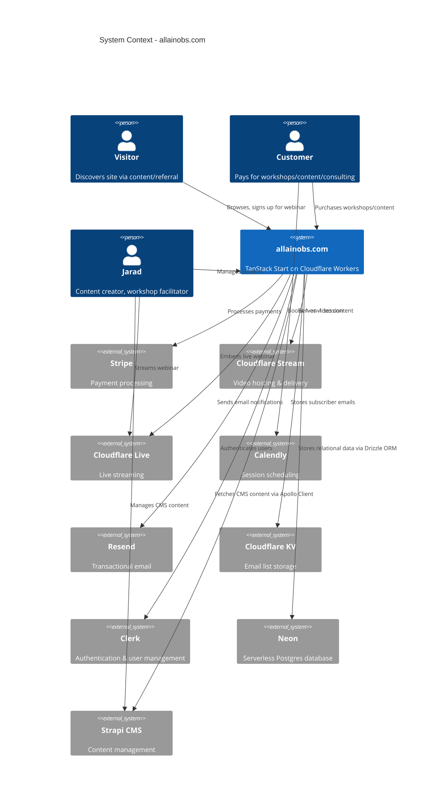
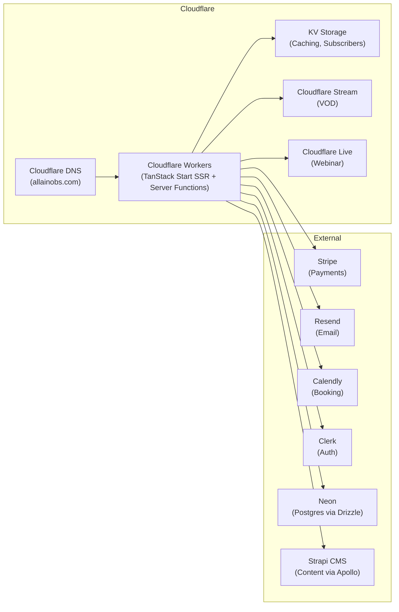

# Architecture Decision Document

## 1. System Context

allainobs.com is a marketing, commerce, and content delivery platform for an AI consulting business. It is a TanStack Start application deployed on Cloudflare Workers, integrating with Cloudflare Stream/Live for video, Stripe for payments, Clerk for authentication, Neon (Postgres) + Drizzle ORM for persistent data, Strapi CMS for content management, and external services for email and scheduling.

### System Context Diagram



---

## 2. Architecture Decisions

### AD-1: Hosting Platform

**Decision:** Cloudflare Workers with `@cloudflare/vite-plugin` (TanStack Start + Vite)

**Context:** Need SSR with server functions for webhooks and data loading, plus tight integration with Cloudflare Stream/Live/KV. TanStack Start provides a full-stack React framework built on Vite with file-based routing (TanStack Router), server functions, and first-class SSR support.

**Alternatives Considered:**
- Vercel + Next.js: Mature SSR platform, but adds a separate billing/vendor layer when we're already deep in Cloudflare for video
- Cloudflare Pages + Next.js: `@cloudflare/next-on-pages` has compatibility gaps; TanStack Start's Vite-based build integrates more naturally with Cloudflare Workers via `@cloudflare/vite-plugin`
- Self-hosted: Maximum control but unnecessary ops overhead for a marketing site

**Rationale:** Single vendor for hosting, video, DNS, KV storage, and CDN. TanStack Start's Vite-native architecture pairs cleanly with `@cloudflare/vite-plugin` for Cloudflare Workers deployment. The TanStack ecosystem (Router, Query, Form, Table, Store) provides a cohesive full-stack solution with excellent type safety. pnpm is used as the package manager.

**Fallback:** If Cloudflare Workers deployment proves problematic, TanStack Start supports multiple deployment targets (Node.js, Vercel, Netlify). Migrating to Vercel would require minimal config changes while keeping Cloudflare for video/DNS.

---

### AD-2: Video Architecture

**Decision:** Cloudflare Stream (VOD) + Cloudflare Live (webinar)

**Context:** Two distinct video needs: (1) on-demand content library with payment gating, (2) live bi-weekly webinar streaming.

**Implementation:**
- **VOD (Cloudflare Stream):** Upload videos via Dashboard or API. Each video gets a `stream_id`. Free videos embed directly. Premium videos require a signed URL generated after Stripe payment verification.
- **Live (Cloudflare Live):** Create a live input, stream via OBS/similar. Embed the live player on the webinar section. Recordings auto-save to Stream for replay.

**Access Control for Premium Content:**
```
User clicks "Watch" on premium video
  -> Client requests signed URL from server function
  -> Server function checks Stripe purchase status (via customer email lookup)
  -> If paid: generate Cloudflare Stream signed URL (time-limited)
  -> If not paid: redirect to Stripe Checkout
  -> Signed URL returned, player loads video
```

**Authentication:** Clerk provides user authentication and account management. Stripe customer identity is linked to Clerk user accounts. Signed URLs with short TTLs (4 hours) provide adequate video access control.

---

### AD-3: Payment Architecture

**Decision:** Stripe Checkout (hosted) + Webhooks

**Context:** Need to accept payments for workshops and premium video content without building custom payment UI.

**Implementation:**
- **Checkout Sessions:** Created via server functions. Each product (workshop, video) maps to a Stripe Price.
- **Webhooks:** `checkout.session.completed` webhook fires on success. Server function at the Stripe webhook endpoint handles:
  - Workshop enrollment: Store customer email + workshop ID in KV
  - Video access: Store customer email + video ID in KV
- **Webhook security:** Verify Stripe signature using `stripe.webhooks.constructEvent()`

**Flow:**
```
User clicks "Enroll" / "Purchase"
  -> Server function creates Stripe Checkout Session
  -> Redirect to Stripe hosted checkout
  -> Payment completes
  -> Stripe fires webhook to server function endpoint
  -> Server function stores access grant in Neon (via Drizzle) and/or KV
  -> User redirected to success page with access
```

---

### AD-4: Data Storage

**Decision:** Neon (serverless Postgres) + Drizzle ORM as primary data store, Cloudflare KV for caching and fast key-value lookups

**Context:** The platform needs relational data for users, purchases, enrollments, content metadata, and course tracking. Neon provides serverless Postgres with a generous free tier. Drizzle ORM provides type-safe database access with schema-as-code. KV supplements for high-speed lookups and caching.

**Primary Database (Neon + Drizzle):**
- User profiles and authentication data (linked to Clerk)
- Purchase records and access grants
- Workshop enrollment and tracking
- Content metadata and relationships
- Schema managed via Drizzle migrations (`drizzle.config.ts`)

**KV Namespaces (supplementary):**
- `SUBSCRIBERS`: Key = email, Value = `{ subscribed_at, source, webinar_notify: bool }`
- Session caching and fast access-grant lookups

**Why Neon + Drizzle:** Neon provides true serverless Postgres with branching, auto-scaling, and a generous free tier. Drizzle ORM offers excellent TypeScript integration with schema-as-code and type-safe queries. This combination supports the relational queries needed for user accounts (Clerk), course tracking, and content management (Strapi) while KV handles high-throughput caching needs.

---

### AD-5: Email Architecture

**Decision:** Resend for transactional email, Cloudflare KV for subscriber storage

**Context:** Need email capture (webinar notifications, newsletter) and transactional sends (purchase confirmations, webinar reminders).

**Implementation:**
- Email signup form calls a server function for subscription
- Server function stores email in KV `SUBSCRIBERS` namespace
- Resend API sends transactional emails (welcome, webinar reminder, purchase confirmation)
- Webinar reminders triggered via Cloudflare Cron Triggers (scheduled worker)

**Why Resend:** Simple API, good deliverability, generous free tier (100 emails/day), no vendor lock-in (standard SMTP fallback). Aligns with the "control over third-party dependencies" principle.

---

### AD-6: Frontend Architecture

**Decision:** TanStack Start + TanStack Router (file-based routing) + Tailwind CSS v4 + shadcn/ui

**Context:** Already scaffolded with TanStack CLI. Dark theme with emerald accents. Component-based architecture. Additional TanStack ecosystem libraries: Query (data fetching), Form (form management), Table (data tables), Store (state management). Apollo Client for Strapi CMS GraphQL integration.

**Component Structure:**
```
src/
  routes/
    __root.tsx            # Root layout (wraps all routes)
    index.tsx             # Landing page (composes sections)
    about.tsx             # About page
    demo/
      clerk.tsx           # Clerk auth demo
      drizzle.tsx         # Drizzle ORM demo
      neon.tsx            # Neon database demo
      strapi.tsx          # Strapi CMS content listing
      strapi.$articleId.tsx # Strapi article detail
      form.simple.tsx     # TanStack Form demo
      form.address.tsx    # TanStack Form address demo
      store.tsx           # TanStack Store demo
      table.tsx           # TanStack Table demo
      tanstack-query.tsx  # TanStack Query demo
  components/
    Header.tsx            # Header with navigation
    Footer.tsx            # Footer + contact
    ThemeToggle.tsx       # Dark/light theme toggle
    blocks/               # Content block renderers (rich-text, media, etc.)
    ui/                   # shadcn/ui components (button, etc.)
    markdown-content.tsx  # Markdown renderer
    search.tsx            # Search component
    pagination.tsx        # Pagination component
    strapi-image.tsx      # Strapi image wrapper
  integrations/
    clerk/
      header-user.tsx     # Clerk user component for header
      provider.tsx        # Clerk auth provider
    tanstack-query/
      root-provider.tsx   # TanStack Query provider
      devtools.tsx        # TanStack Query devtools
  data/
    loaders/
      articles.ts         # Strapi article data loaders
      index.ts            # Loader barrel exports
    strapi-sdk.ts         # Strapi SDK client
  db/
    index.ts              # Drizzle database client (Neon)
    schema.ts             # Drizzle schema definitions
  lib/
    strapi-utils.ts       # Strapi helper utilities
    demo-store.ts         # TanStack Store demo
    demo-store-devtools.tsx # Store devtools
  types/
    strapi.ts             # Strapi type definitions
  router.tsx              # TanStack Router configuration
  routeTree.gen.ts        # Auto-generated route tree
  styles.css              # Global styles
  start.ts                # TanStack Start entry point
```

**Rendering Strategy:**
- All pages: SSR via TanStack Start loaders (server functions execute on Cloudflare Workers)
- Route loaders: Data fetching runs server-side before render via TanStack Router loaders
- Server functions: Replace traditional API routes; handle webhooks, mutations, and authenticated data access
- Client interactivity: TanStack Query for client-side cache/refetch, TanStack Store for local state
- Webinar page: Client-side (live embed, no SSR needed)

**Build & Dev:**
- Build tool: Vite with `@cloudflare/vite-plugin` (configured in `vite.config.ts`)
- Dev server: `vite dev` (Cloudflare Workers local runtime via vite plugin)
- Deployment config: `wrangler.jsonc`
- Package manager: pnpm

---

## 3. Integration Patterns

### 3.1 Cloudflare Stream Integration

```typescript
// Signed URL generation for premium content
async function getSignedStreamUrl(videoId: string, email: string): Promise<string | null> {
  // Check access in KV
  const accessKey = `${email}:video:${videoId}`;
  const access = await env.ACCESS_GRANTS.get(accessKey);
  if (!access) return null;

  // Generate signed URL via Cloudflare Stream API
  const token = await generateStreamSignedToken(videoId, {
    exp: Math.floor(Date.now() / 1000) + 14400, // 4 hour TTL
  });
  return `https://customer-${ACCOUNT_HASH}.cloudflarestream.com/${token}/manifest/video.m3u8`;
}
```

### 3.2 Stripe Webhook Handler

```typescript
// Server function for Stripe webhook handling
export async function POST(request: Request) {
  const body = await request.text();
  const sig = request.headers.get('stripe-signature');
  const event = stripe.webhooks.constructEvent(body, sig, WEBHOOK_SECRET);

  if (event.type === 'checkout.session.completed') {
    const session = event.data.object;
    const email = session.customer_details.email;
    const metadata = session.metadata; // { content_type, content_id }

    // Grant access in KV
    const key = `${email}:${metadata.content_type}:${metadata.content_id}`;
    await env.ACCESS_GRANTS.put(key, JSON.stringify({
      granted_at: new Date().toISOString(),
      stripe_session_id: session.id,
    }));

    // Send confirmation email via Resend
    await sendPurchaseConfirmation(email, metadata);
  }

  return new Response('ok', { status: 200 });
}
```

---

## 4. Deployment Architecture



### CI/CD

- **Source:** GitHub repository
- **Build:** Vite builds TanStack Start app; deployed to Cloudflare Workers via `wrangler` (configured in `wrangler.jsonc`)
- **Preview:** PR-based preview deployments via Cloudflare Workers
- **Environment variables:** Stored in Cloudflare dashboard and `.env` locally (Stripe keys, Resend API key, Stream API token, Clerk keys, Neon connection string, Strapi URL/token)

---

## 5. Security Considerations

| Concern | Mitigation |
|---------|------------|
| Stripe webhook tampering | Signature verification with `constructEvent()` |
| Premium video URL sharing | Signed URLs with 4-hour TTL, tied to customer email |
| Email injection | Server-side validation, rate limiting on subscribe endpoint |
| XSS | React's built-in escaping, CSP headers |
| CSRF | SameSite cookies, Stripe Checkout is hosted (no custom form) |
| API key exposure | All secrets in Cloudflare Workers env vars and `.env`, never client-side |
| Auth bypass | Clerk handles session management, token verification, and protected routes |

---

## 6. Scalability Path

The MVP architecture is intentionally simple. Here's the migration path as the business grows:

| Trigger | Migration |
|---------|-----------|
| Need advanced user roles | Extend Clerk with custom roles/permissions (Clerk already integrated) |
| Need complex content workflows | Extend Strapi CMS with custom content types and workflows (Strapi already integrated) |
| Need course tracking | Add Drizzle schema tables for progress/completion (Neon + Drizzle already integrated) |
| High video volume | Cloudflare Stream scales automatically |
| Email list > 10K | Migrate to ConvertKit or similar ESP |
| Need real-time features | Add Cloudflare Durable Objects or WebSocket support via Workers |

---

## 7. Development Priorities

| Order | Component | Rationale |
|-------|-----------|-----------|
| 1 | Landing page polish | Already scaffolded with TanStack Start + shadcn/ui, finish design |
| 2 | Clerk auth integration | User accounts and access control (already scaffolded) |
| 3 | Email capture server function | Highest-value MVP feature (lead gen) |
| 4 | Stripe integration | Revenue enablement |
| 5 | Strapi CMS content pages | Content management for articles and learning materials |
| 6 | Cloudflare Stream video player | Content delivery |
| 7 | Cloudflare Live embed | Webinar infrastructure |
| 8 | Calendly integration | 1-on-1 booking |
| 9 | SEO optimization | Organic traffic growth |
| 10 | Cloudflare Workers deployment | Go live on allainobs.com |
